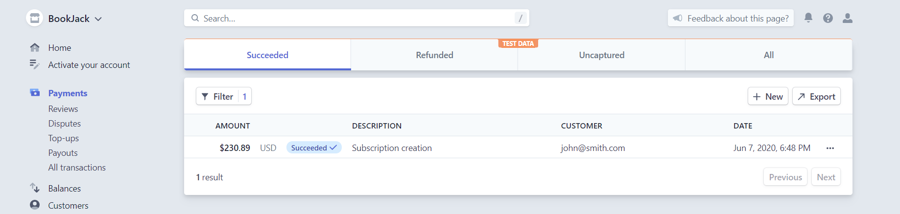

# BookJack-Stripe

ASP.NET Core app with integrated Stripe payment gateway to enable selling products online. Implemented are one-time and subscription-based payments to users. Displayed is a custom admin dashboard with overview of merchant's Stripe account.

### Product Catalog

### On Confirm payment click (Sandbox mode)

### Custom Admin dashboard

### Overview of Payments on Stripe account

